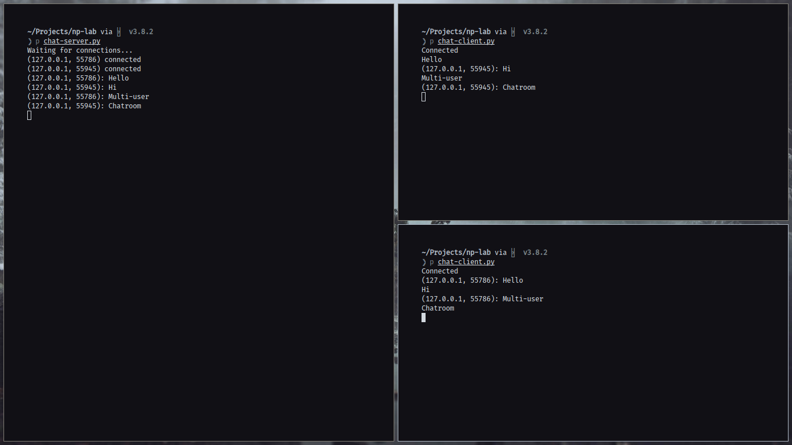
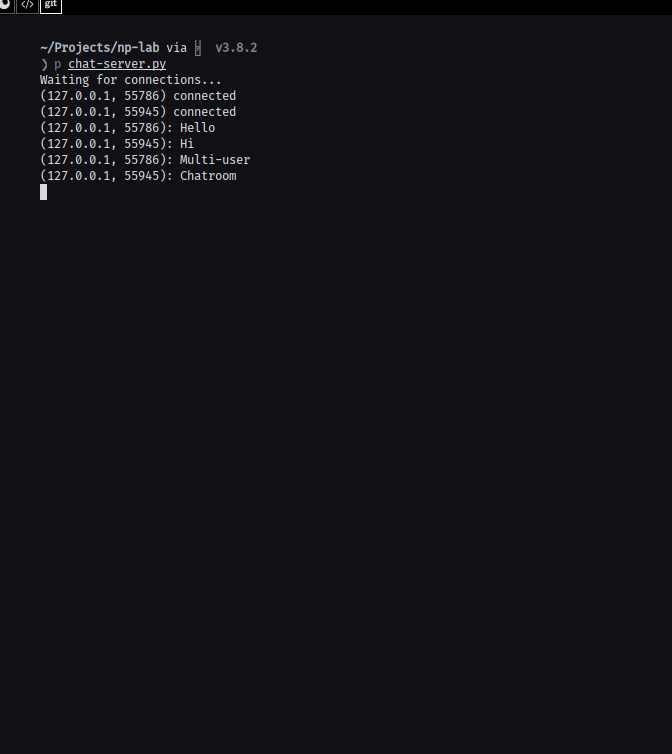
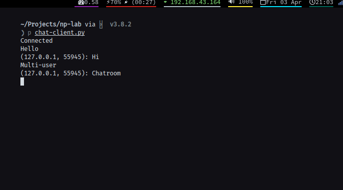
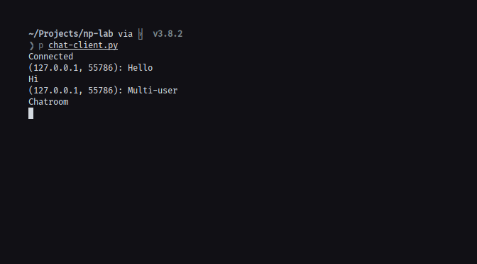

## Aim

To implement a multi user chat server using TCP as transport layer protocol.

## Theory

TCP (Transmission Control Protocol) works with the Internet Protocol (IP),
which defines how computers send packets of data to each other. Together, TCP
and IP are the basic rules defining the Internet. It is a connection-oriented protocol,
which means that a connection is established and maintained until the application
programs at each end have finished exchanging messages.

Server - In a simple multi user chat system, the server usually has the role to
receive the messages sent by the clients and send it to all other clients. So basically,
he handles the routing of the messages sent by one client to all the other clients.

Client - The client here acts from the side of the user. He sends the messages
to the server, and the server sends this message to all the other clients to simulate
a simple multi-user chat system.

## Code

### Server Code:

```python
#!/bin/python

import socket
import threading


class ClientThread(threading.Thread):
    def __init__(self, conn, addr):
        self.conn = conn
        self.addr = addr

    def run(self):
        conn.send("Welcome to this chatroom.")
        while True:
            try:
                msg = conn.recv(1024)
                if msg:
                    print(f"{addr}: {msg}")
                    broadcast(f"{addr}: {msg}", conn)
                else:
                    remove(conn)
            except:
                continue


sock = socket.socket(socket.AF_INET, socket.SOCK_STREAM)
sock.setsockopt(socket.SOL_SOCKET, socket.SO_REUSEADDR, 1)

sock.bind(("127.0.0.1", 8888))

sock.listen(100)

clients = []


def client_fn(conn, addr):
    conn.send("Welcome to this chatroom.")
    while True:
        try:
            msg = conn.recv(1024)
            if msg:
                print(f"{addr}: {msg}")
                broadcast(f"{addr}: {msg}", conn)
            else:
                remove(conn)
        except:
            continue


def broadcast(msg, conn):
    for client in clients:
        if client != conn:
            try:
                client.send(msg)
            except:
                client.close()
                remove(client)


def remove(conn):
    if conn in clients:
        clients.remove(conn)


print("Waiting for connections...")
while True:
    conn, addr = sock.accept()
    clients.append(conn)
    print(addr, "connected")
    # thread.start_new_thread(client_fn, (conn, addr))
    thread = ClientThread(conn, addr)
    thread.start()
```

### Client Code:

```python
#!/bin/python

import socket
import select
import sys

sock = socket.socket(socket.AF_INET, socket.SOCK_DGRAM)

sock.connect(("127.0.0.1", 8888))
print("Connected!")

while True:
    read, write, error = select.select([sys.stdin, sock], [], [])
    print(read)
    for r in read:
        # print(r)
        if r == sock:
            msg = sock.recv(2048)
            print(msg.decode())
        else:
            msg = sys.stdin.readline()
            sock.send(msg.encode())

sock.close()
```

## Output








