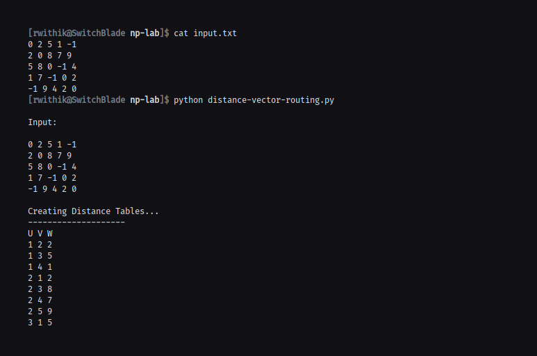

## Aim

To implement and simulate algorithm for distance vector routing protocol.

## Theory

Distance - Vector Routing Protocol in data networks is basically used to de-
termine the best route for data packets based on distance. Distance-vector rout-
ing protocols measure the distance by the number of routers a packet has to pass
through, where one router counts as one hop. In some cases, distance-vector proto-
cols also take into account network latency and other factors that influence traffic
on a given route. To determine the best route across a network routers, on which
a distance-vector protocol is implemented, exchange information with one another,
usually routing tables plus hop counts for destination networks and possibly other
traffic information. Distance-vector routing protocols also require that a router in-
forms its neighbours of network topology changes periodically.

Distance-vector routing protocols commonly use the Bellman–Ford algorithm and
Ford–Fulkerson algorithm to calculate the best possible route. The term distance
vector refers to the fact that the protocol manipulates vectors of distances to other
nodes in the network. In the earlier days, this routing algorithm was implemented
more widely in local area networks with the Routing Information Protocol(RIP).

## Algorithm

1. A router transmits its distance vector to each of its neighbors in a routing packet.
2. Each router receives and saves the most recently received distance vector from each of its neighbors.
3. A router recalculates its distance vector when:
   1. It receives a distance vector from a neighbor containing different information than before.
   2. It discovers that a link to a neighbor has gone down.

## Code

```python
#!/bin/python

router_matrix = []
nodes = []
distances = {}
num_nodes = 0
edges = []


def process_file(fname):

    global router_matrix
    router_matrix = []

    with open(fname) as f:

        router_matrix = [list(map(int, x.split(" "))) for x in f]

    print("\nInput:\n")

    for line in router_matrix:
        for item in line:
            print(item, end=" ")
        print()

    print()
    set_distances(router_matrix)


def set_distances(router_matrix):
    global distances
    global nodes
    distances = {}
    nodes = []

    num_nodes = len(router_matrix)
    print("Creating Distance Tables... ")

    for i in range(num_nodes):
        tempdict = {}
        for j in range(num_nodes):
            if i != j and router_matrix[i][j] != -1:
                tempdict[j + 1] = router_matrix[i][j]

        distances[i + 1] = tempdict
        nodes.append(i + 1)
    set_edges()


def set_edges():
    print("--------------------")
    print("U", "V", "W")
    for key, value in distances.items():
        u = key
        value = dict(value)
        for v, wt in value.items():
            print(u, v, wt)
            edges.append([u, v, wt])

    print("---------------------")


def bellman_ford(src):
    global nodes
    nextHop = {}
    nextHop = {node: None for node in nodes}
    num_of_nodes = len(router_matrix)
    dist = [float("Inf")] * (num_of_nodes + 1)
    dist[src] = 0

    for i in range(num_of_nodes - 1):
        for u, v, wt in edges:
            if dist[u] != float("Inf") and dist[u] + wt < dist[v]:
                dist[v] = dist[u] + wt
                if not nextHop[v]:
                    nextHop[v] = v
                else:
                    nextHop[v] = nextHop[u]

    print("Table for Router : ", src)
    print("Destination \t Next Hop \t Distance")

    destination_list = list()
    nextHop_list = list()
    destination_list.append(999)
    nextHop_list.append(999)

    for k, v in nextHop.items():
        if v is None:
            v = src
        destination_list.append(k)
        nextHop_list.append(v)

    for i in range(1, num_of_nodes + 1):
        print(
            "%d \t\t\t %d \t\t\t %d" % (destination_list[i], nextHop_list[i], dist[i])
        )


process_file("input.txt")

numof_nodes = len(router_matrix)

for i in range(1, numof_nodes + 1):
    bellman_ford(i)
```

## Output



```

Input:

0 2 5 1 -1
2 0 8 7 9
5 8 0 -1 4
1 7 -1 0 2
-1 9 4 2 0

Creating Distance Tables...
--------------------
U V W
1 2 2
1 3 5
1 4 1
2 1 2
2 3 8
2 4 7
2 5 9
3 1 5
3 2 8
3 5 4
4 1 1
4 2 7
4 5 2
5 2 9
5 3 4
5 4 2
---------------------
Table for Router :  1
Destination 	 Next Hop 	 Distance
1 			 1 			 0
2 			 2 			 2
3 			 3 			 5
4 			 4 			 1
5 			 4 			 3
Table for Router :  2
Destination 	 Next Hop 	 Distance
1 			 1 			 2
2 			 2 			 0
3 			 1 			 7
4 			 1 			 3
5 			 1 			 5
Table for Router :  3
Destination 	 Next Hop 	 Distance
1 			 1 			 5
2 			 1 			 7
3 			 3 			 0
4 			 4 			 6
5 			 5 			 4
Table for Router :  4
Destination 	 Next Hop 	 Distance
1 			 1 			 1
2 			 1 			 3
3 			 3 			 6
4 			 4 			 0
5 			 5 			 2
Table for Router :  5
Destination 	 Next Hop 	 Distance
1 			 4 			 3
2 			 4 			 5
3 			 3 			 4
4 			 4 			 2
5 			 5 			 0
```
