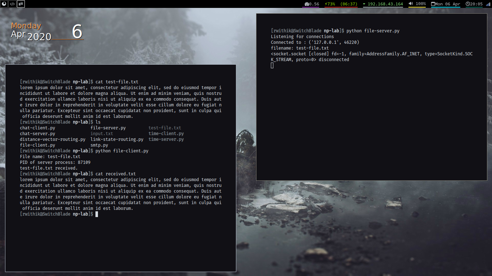

## Aim

To develop a concurrent file server which will provide the file requested by client if
it exists. If not server sends appropriate message to the client. Server should also
send its process ID (PID) to clients for display along with file or the message.

## Theory

FTP (File Transfer Protocol) is a client-server protocol that may be used to
transfer files between computers on the internet. The client asks for the files and
the server provides them. It is a standard network protocol used for the transfer of
computer files between a client and server on a computer network. FTP is built on
a client-server model architecture and uses separate control and data connections
between the client and the server.FTP users may authenticate themselves with a
clear-text sign-in protocol, normally in the form of a username and password, but
can connect anonymously if the server is configured to allow it.

**Server** - Server should accept the incoming connection requests and establish a
connection with the client. After this, it should check if the corresponding requested
file is present or not. If found, the file is to be returned. Else the appropriate mes-
sage is to be returned. The process ID is also to be sent to the client.

**Client** - After proper connection is established, the client should send the name
of the file to be searched for. If found, the client should be able to receive the file
as well as the PID of the server.

## Code

### Server

```python
import socket
from _thread import start_new_thread
import threading
from os import getpid

print_lock = threading.Lock()
pid = getpid()


def threaded(c):
    while True:
        try:
            data = c.recv(1024)
        except Exception:
            break

        if not data:
            break

        fileName = data.decode()
        print(f"filename: {fileName}")
        c.send(str(pid).encode())

        try:
            file = open(fileName, "rb")
        except FileNotFoundError:
            c.send("File Not Found")
            print("File Not Found")
            break

        inp = file.read(1024)
        while inp:
            c.send(inp)
            inp = file.read(1024)
        c.send("".encode())

        c.close()

    print(f"{c} disconnected")
    print_lock.release()


def main():
    s = socket.socket(socket.AF_INET, socket.SOCK_STREAM)
    s.bind(("127.0.0.1", 9999))
    s.listen(5)
    print("Listening for connections")

    while True:

        c, addr = s.accept()

        print_lock.acquire()
        print("Connected to :", addr)

        start_new_thread(threaded, (c,))
    s.close()


if __name__ == "__main__":
    main()

```

### Client

```python
import socket


def main():
    s = socket.socket(socket.AF_INET, socket.SOCK_STREAM)
    s.connect(("127.0.0.1", 9999))

    fileName = input("File name: ")
    # fileName = "test-file.txt"

    outputFile = open("received.txt", "wb")
    s.send(fileName.encode())
    pid = s.recv(1024)
    print(f"PID of server process: {pid.decode()}")
    data = s.recv(1024)
    while data:
        if not data.decode():
            s.shutdown(socket.SHUT_WR)
            break
        # print(data)
        outputFile.write(data)
        data = s.recv(1024)

    s.close()
    print(f"{fileName} received.")


if __name__ == "__main__":
    main()

```

## Output




