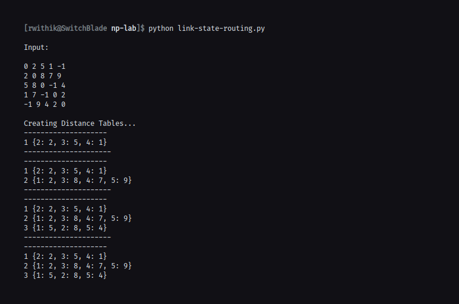

## Aim

To implement and simulate algorithm for link state routing protocol.

## Theory

Link-State Routing Protocols are one of the two main classes of routing protocols
used in packet switching networks for computer communications, the other being
distance-vector routing protocols. Examples of link-state routing protocols include
Open Shortest Path First (OSPF) and Intermediate System to Intermediate System
(IS-IS).

The link-state protocol is performed by every switching node in the network
(i.e., nodes that are prepared to forward packets; in the Internet, these are called
routers). The basic concept of link-state routing is that every node constructs a map
of the connectivity to the network, in the form of a graph, showing which nodes are
connected to which other nodes. Each node then independently calculates the next
best logical path from it to every possible destination in the network. Each collection
of best paths will then form each node’s routing table.

## Algorithm

1. Start
2. Read the cost matrix
3. Read the source router
4. For v in routers
   1. If v is a neighbour of u, distance[v] = cost[u][v]
   2. Else, distance[v] = inf
   3. Iterate over the routes in the network and find a node w such that distance[w] is minimum
   4. Print distance[v] for all nodes v

## Code

```python
router_matrix = []
nodes = []
distances = {}
unvisited = {}
previous = {}
visited = {}
interface = {}
start = 0


def process_file(fname):
    global router_matrix
    router_matrix = []
    with open(fname) as f:
        router_matrix = [list(map(int, x.split(" "))) for x in f]

    print("\nInput:\n")

    for line in router_matrix:
        for item in line:
            print(item, end=" ")
        print()

    print()
    set_distances(router_matrix)


def set_distances(router_matrix):

    global distances
    global nodes
    distances = {}
    nodes = []
    num_nodes = len(router_matrix)

    print("Creating Distance Tables...")
    for i in range(num_nodes):
        tempdict = {}
        for j in range(num_nodes):
            if i != j and router_matrix[i][j] != -1:
                tempdict[j + 1] = router_matrix[i][j]

        distances[i + 1] = tempdict
        nodes.append(i + 1)
        print("--------------------")
        for key, value in distances.items():
            print(key, value)
        print("---------------------")


def dijkstra(start):

    global distances
    global nodes
    global unvisited
    global previous
    global visited
    global interface

    unvisited = {node: None for node in nodes}
    previous = {node: None for node in nodes}
    interface = {node: None for node in nodes}
    visited = {node: None for node in nodes}
    current = start
    currentDist = 0
    unvisited[current] = currentDist
    print("Building the Router Table for Router:", start)

    while True:
        for next, distance in distances[current].items():
            if next not in unvisited:
                continue

            newDist = currentDist + distance
            if not unvisited[next] or unvisited[next] > newDist:
                unvisited[next] = newDist
                previous[next] = current
                if not interface[current]:
                    interface[next] = next
                else:
                    interface[next] = interface[current]

        visited[current] = currentDist
        del unvisited[current]
        isOver = 1

        for x in unvisited:
            if unvisited[x]:
                isOver = 0
                break

        if not unvisited or isOver:
            break

        elements = [node for node in unvisited.items() if node[1]]
        current, currentDist = sorted(elements, key=lambda x: x[1])[0]


process_file("input.txt")
start = 0

for i in range(1, len(nodes) + 1):
    start = i
    dijkstra(start)
    print("---------------------------------")
    print("Routing Table For:", start)
    print("\nDestination\tInterface")
    for key in interface:
        print(key, "\t\t\t", interface[key])
    print("---------------------------------")

```

## Output



```

Input:

0 2 5 1 -1
2 0 8 7 9
5 8 0 -1 4
1 7 -1 0 2
-1 9 4 2 0

Creating Distance Tables...
--------------------
1 {2: 2, 3: 5, 4: 1}
---------------------
--------------------
1 {2: 2, 3: 5, 4: 1}
2 {1: 2, 3: 8, 4: 7, 5: 9}
---------------------
--------------------
1 {2: 2, 3: 5, 4: 1}
2 {1: 2, 3: 8, 4: 7, 5: 9}
3 {1: 5, 2: 8, 5: 4}
---------------------
--------------------
1 {2: 2, 3: 5, 4: 1}
2 {1: 2, 3: 8, 4: 7, 5: 9}
3 {1: 5, 2: 8, 5: 4}
4 {1: 1, 2: 7, 5: 2}
---------------------
--------------------
1 {2: 2, 3: 5, 4: 1}
2 {1: 2, 3: 8, 4: 7, 5: 9}
3 {1: 5, 2: 8, 5: 4}
4 {1: 1, 2: 7, 5: 2}
5 {2: 9, 3: 4, 4: 2}
---------------------
Building the Router Table for Router: 1
---------------------------------
Routing Table For: 1

Destination	Interface
1 			 None
2 			 2
3 			 3
4 			 4
5 			 4
---------------------------------
Building the Router Table for Router: 2
---------------------------------
Routing Table For: 2

Destination	Interface
1 			 1
2 			 None
3 			 1
4 			 1
5 			 1
---------------------------------
Building the Router Table for Router: 3
---------------------------------
Routing Table For: 3

Destination	Interface
1 			 1
2 			 1
3 			 None
4 			 5
5 			 5
---------------------------------
Building the Router Table for Router: 4
---------------------------------
Routing Table For: 4

Destination	Interface
1 			 1
2 			 1
3 			 1
4 			 None
5 			 5
---------------------------------
Building the Router Table for Router: 5
---------------------------------
Routing Table For: 5

Destination	Interface
1 			 4
2 			 4
3 			 3
4 			 4
5 			 None
---------------------------------

```
