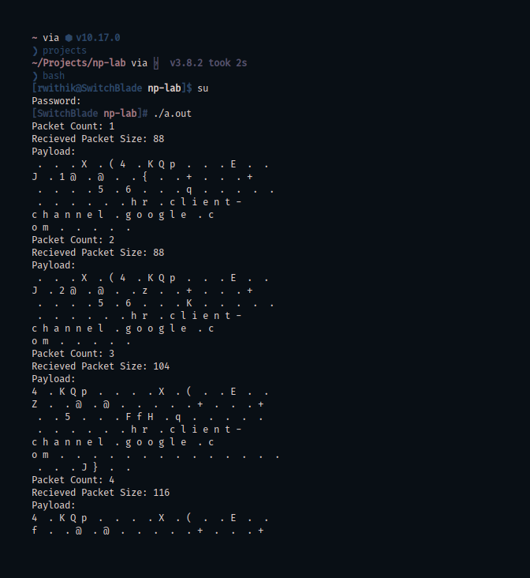

## Aim

To develop a packet capturing and filtering application using raw sockets.

## Theory

### Packet

A packet is a basic unit of communication over a digital network. When data has to be transmitted, it is broken down into similar structures of data before transmission, called packets, which are reassembled to the original data chunk once they reach their destination.

### libpcap

`libpcap` allows us to capture or send packets from a live network device or a file. This package is aimed at Debian based Linux distributions. Compiling a pcap program requires linking with the pcap lib.

## Code

```c
#include <pcap.h>
#include <stdio.h>
#include <stdlib.h>
#include <errno.h>
#include <sys/socket.h>
#include <netinet/in.h>
#include <arpa/inet.h>
#include <netinet/if_ether.h>

void callback(u_char *arg, const struct pcap_pkthdr* pkthdr,
        const u_char* packet)
{
    int i=0;
    static int count=0;

    printf("Packet Count: %d\n", ++count);
    printf("Recieved Packet Size: %d\n", pkthdr->len);
    printf("Payload:\n");
    for(i=0;i<pkthdr->len;i++) {
        if(isprint(packet[i]))
            printf("%c ",packet[i]);
        else
            printf(" . ",packet[i]);
        if((i%16==0 && i!=0) || i==pkthdr->len-1)
            printf("\n");
    }
}

int main(int argc,char **argv)
{
    int i;
    char *dev;
    char errbuf[PCAP_ERRBUF_SIZE];
    pcap_t* descr;
    const u_char *packet;
    struct pcap_pkthdr hdr;
    struct ether_header *eptr;
    struct bpf_program fp;
    bpf_u_int32 maskp;
    bpf_u_int32 netp;

    dev = pcap_lookupdev(errbuf);

    if(dev == NULL) {
        fprintf(stderr, "%s\n", errbuf);
        exit(1);
    }
    pcap_lookupnet(dev, &netp, &maskp, errbuf);

    descr = pcap_open_live(dev, BUFSIZ, 1,-1, errbuf);
    if(descr == NULL) {
        printf("pcap_open_live(): %s\n", errbuf);
        exit(1);
    }

    if(pcap_compile(descr, &fp, "ip", 0, netp) == -1) {
        fprintf(stderr, "Error calling pcap_compile\n");
        exit(1);
    }

    if(pcap_setfilter(descr, &fp) == -1) {
        fprintf(stderr, "Error setting filter\n");
        exit(1);
    }

    pcap_loop(descr, -1, callback, NULL);
    return 0;
}
```

## Output


