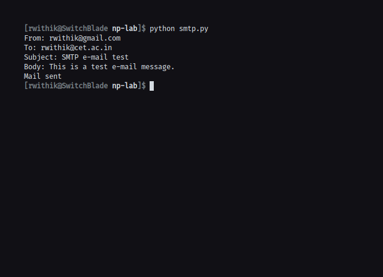
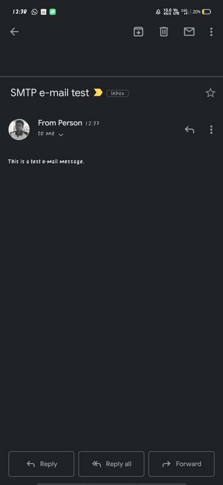

## Aim

Simulation of SMTP(Simple Mail transfer Protocol) using UDP.

## Theory

SMTP is part of the application layer of the TCP/IP protocol. Using a process called
”store and forward,” SMTP moves your email on and across networks. SMTP makes
use of a set of commands to transfer information via the client and server. Some of
the important ones include:

- HELO: The HELO command is used to initiate an SMTP session.
- MAIL FROM: command is used primarily to send email addresses, it needs a way to alert the recipient host to who is sending the inbound message.
- RCPT TO: command tells the receiving host the email address of the message recipient
- DATA: When the sending host transmits the DATA command, it tells the receiving host that a stream of data will follow. End the data stream with <CRLF >.<CRLF >
- QUIT: QUIT command is used to terminate an SMTP session.

Based on similar information regarding SMTP, the basic intent here is to simulate
how SMTP works to move your mail on and across networks.

## Code

```python
import smtplib

fromaddr = "rwithik@gmail.com"
toaddr = "rwithik@cet.ac.in"
print(f"From: {fromaddr}")
print(f"To: {toaddr}")
print(f"Subject: SMTP e-mail test")
print(f"Body: This is a test e-mail message.")

msg = """From: From Person <rwithik@gmail.com>
To: To Person <rwithik@cet.ac.in>
Subject: SMTP e-mail test

This is a test e-mail message.
"""

server = smtplib.SMTP("smtp.gmail.com", 587)
server.ehlo()
server.starttls()
server.ehlo()
server.login(fromaddr, "password")
server.sendmail(fromaddr, toaddr, msg)
print("Mail sent")
```

## Output




