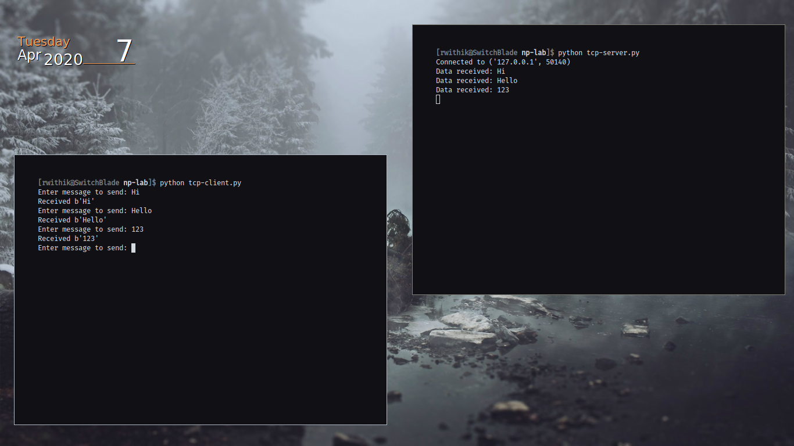
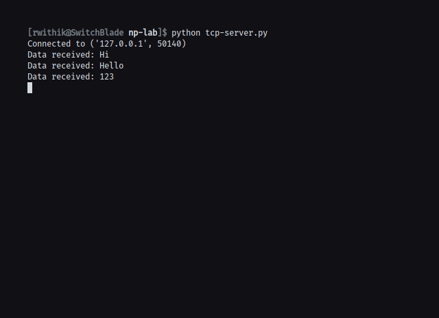
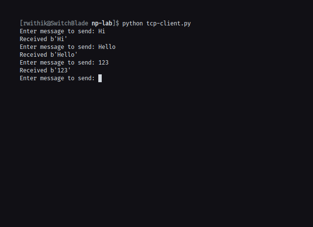

## Aim

To implement Client-Server communication using Socket Programming and TCP as
transport layer protocol.

## Theory

TCP (Transmission Control Protocol) is one of the main protocols in TCP/IP
networks. Transmission control protocol (TCP) is a network communication proto-
col designed to send data packets over the Internet. TCP is a transport layer protocol
in the OSI layer and is used to create a connection between remote computers by
transporting and ensuring the delivery of messages over supporting networks and
the Internet.

It is a connection-oriented protocol, which means that a connection is established
and maintained until the application programs at each end have finished exchanging
messages.

TCP programs are implemented in two parts:

- Server : A server program listens for a connection. On getting a request,
  the server accepts a connection. After the connection is established, server
  and client can exchange messages.

- Client : A client program requests some service. A client program request
  for some resources to the server and server responds to that request. Client
  initiates the connection establishment. The server accepts connection and
  client can request services by exchanging messages.

### Sockets

Implementation of the above two programs (Client and Server) is to be done with
the help of sockets. A socket is one endpoint of a two-way communication link
between two programs running on the network. Client program and server program
create and use sockets to communicate with each other.

## Code

### Server Code:

```python
import socket

HOST = "127.0.0.1"
PORT = 8888

with socket.socket(socket.AF_INET, socket.SOCK_STREAM) as s:
    s.bind((HOST, PORT))
    s.listen()
    conn, addr = s.accept()
    with conn:
        print("Connected to", addr)
        while True:
            data = conn.recv(1024)
            print("Data received:", data.decode())
            conn.sendall(data)

```

### Client Code:

```python
import socket

HOST = "127.0.0.1"
PORT = 8888

with socket.socket(socket.AF_INET, socket.SOCK_STREAM) as s:
    s.connect((HOST, PORT))
    while True:
        msg = input("Enter message to send: ")
        s.sendall(msg.encode())
        data = s.recv(1024)

        print("Received", repr(data))

```

## Output






