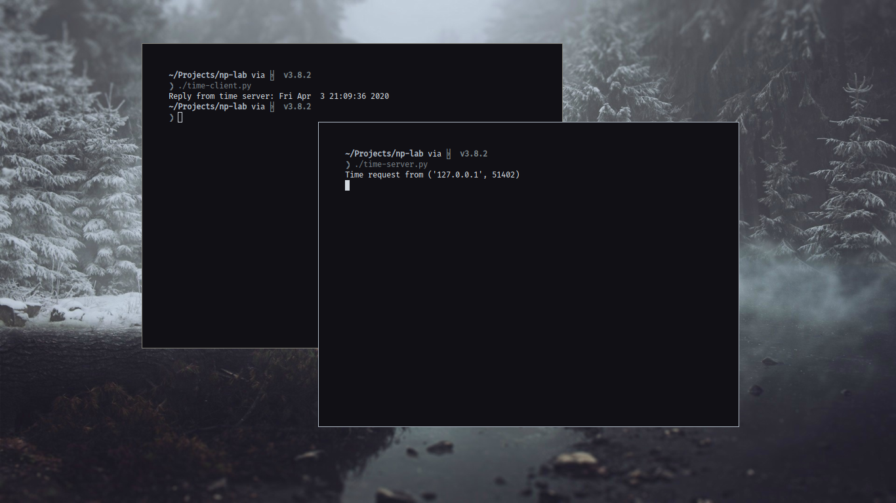
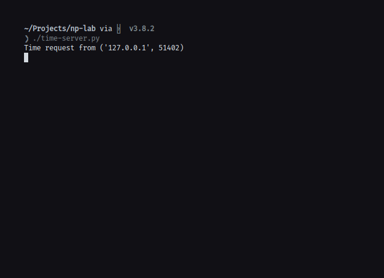
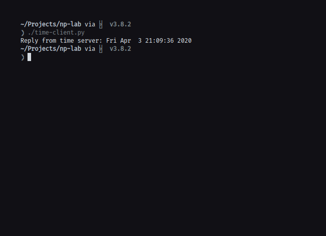

## Aim

To implement Concurrent Time Server application using UDP to execute the pro-
gram at remote server. Client sends a time request to the server, server sends its
system time back to the client. Client displays the result.

## Theory

UDP (User Datagram Protocol) is primarily for establishing low-latency and
loss-tolerating connections between applications on the internet. UDP sends mes-
sages, called datagrams, and is considered a best-effort mode of communications. It
is considered a connectionless protocol because it doesn’t require a virtual circuit to
be established before any data transfer occurs.

Server - The server here waits for the client’s time request. When a request is
received, the present system time of the server is sent to the client.

Client - The client sends the server a time request. The response from the server
is received and provided as the output

## Code

### Server Code:

```python
#!/bin/python

import socket
import time

ip = "127.0.0.1"
port = 8888

sock = socket.socket(socket.AF_INET, socket.SOCK_DGRAM)

sock.bind((ip, port))

while True:
    req, client_ip = sock.recvfrom(10)
    print(f"Time request from {client_ip}")

    sock.sendto(str.encode(time.asctime()), client_ip)
```

### Client Code:

```python
#!/bin/python

import socket

sock = socket.socket(socket.AF_INET, socket.SOCK_DGRAM)

sock.sendto(str.encode("Time request"), ("127.0.0.1", 8888))

reply = sock.recvfrom(1024)

print(f"Reply from time server: {reply[0].decode()}")
```

## Output






