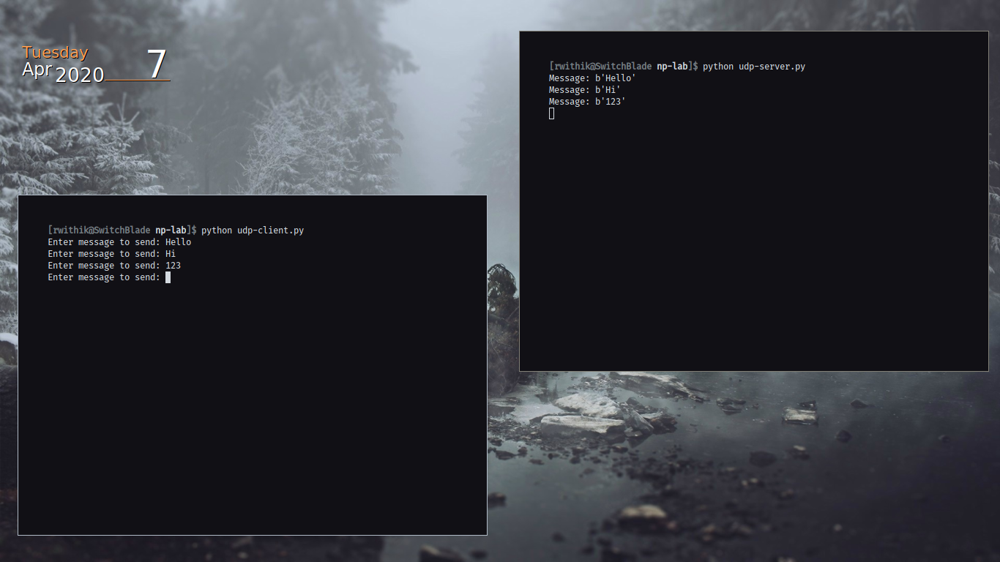
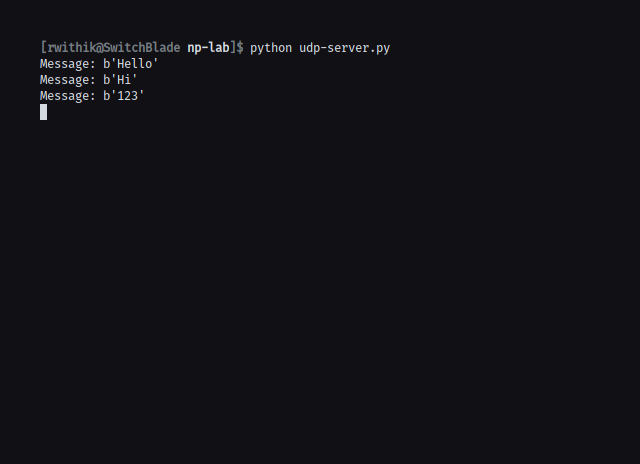
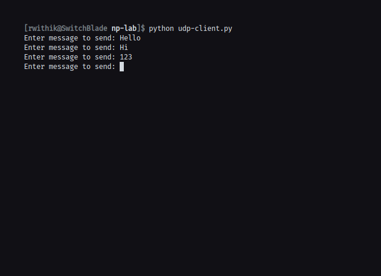

## Aim

To implement Client-Server communication using Socket Programming and UDP as
transport layer protocol.

## Theory

UDP (User Datagram Protocol) is an alternative communications protocol to
Transmission Control Protocol (TCP) used primarily for establishing low-latency
and loss-tolerating connections between applications on the internet. UDP enables
process-to-process communication. UDP sends messages, called datagrams, and is
considered a best-effort mode of communications. It is considered a connectionless
protocol because it doesn’t require a virtual circuit to be established before any data
transfer occurs.

Server & Client - Since the UDP is a connectionless protocol, they do not re-
quire a connection to get established prior to data transmission or reception. Hence
data can be sent between them directly.

## Code

### Server Code:

```python
import socket

serverSock = socket.socket(socket.AF_INET, socket.SOCK_DGRAM)
serverSock.bind(("127.0.0.1", 6789))

while True:
    data, addr = serverSock.recvfrom(1024)
    print("Message:", data)
```

### Client Code:

```python
import socket

UDP_IP_ADDRESS = "127.0.0.1"
UDP_PORT_NO = 6789
message = "Hello, Server"

clientSock = socket.socket(socket.AF_INET, socket.SOCK_DGRAM)
while True:
    message = input("Enter message to send: ")
    clientSock.sendto(message.encode(), (UDP_IP_ADDRESS, UDP_PORT_NO))
```

## Output






