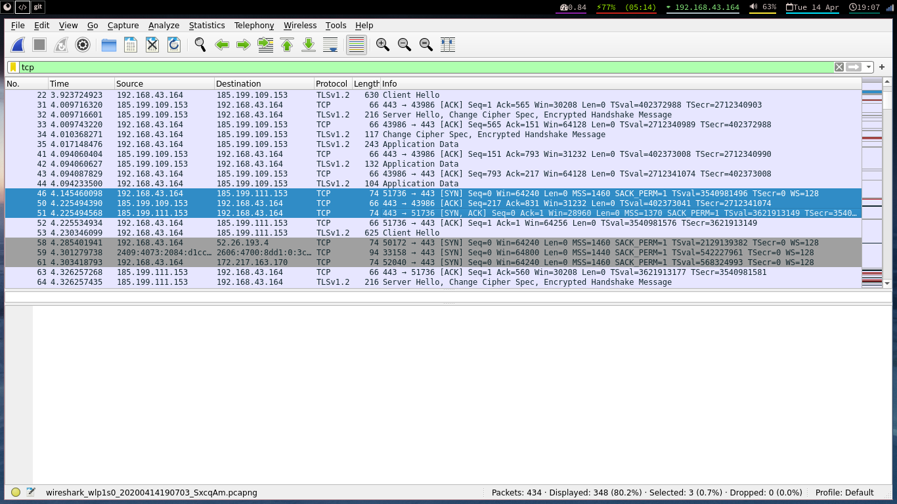
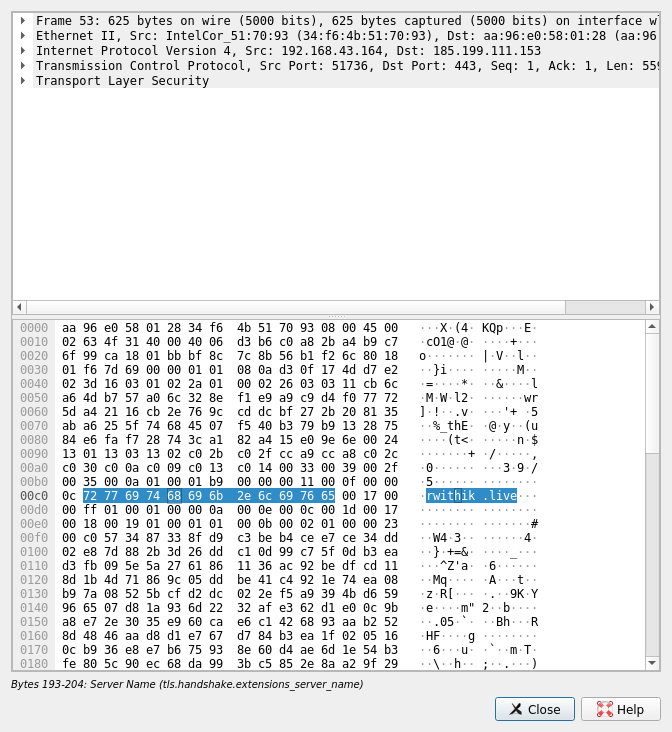
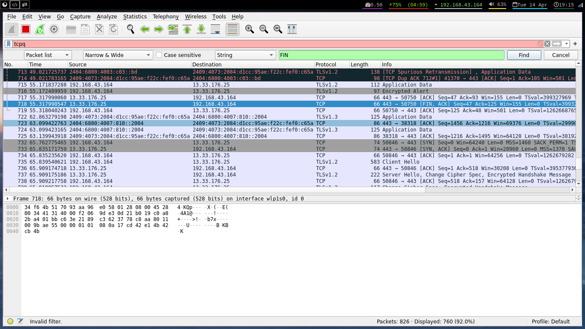

## Aim

Using Wireshark observe three way handshaking connection establishment, data
transfer and three way handshaking connection termination in client server commu-
nication using TCP.

## Theory

TCP provides reliable communication using the concept called Positive Acknowl-
edgement with Re-transmission(PAR). A device using PAR resends the data unit
until it receives an acknowledgement. If the data unit received at the receiver’s end
is damaged, then the receiver discards the segment. So the sender has to resend
the data unit for which positive acknowledgement is not received. From this, we
can understand that three segments are exchanged between sender(client) and re-
ceiver(server) for a reliable TCP connection to get established. These three steps
can be explained as follows:

- Step 1(SYN): Here, the client wants to establish a connection with server, so it
  sends a segment with SYN(Synchronize Sequence Number) which informs the
  server that the client is likely to start communication and with what sequence
  number it starts the segments with.
- Step 2(SYN + ACK): In response, the server replies with a SYN-ACK. The
  acknowledgment number is set to one more than the received sequence number
  , and the sequence number that the server chooses for the packet is another
  random number.
- Step 3(ACK): Finally, the client sends an ACK back to the server. The se-
  quence number is set to the received acknowledgement value , and the ac-
  knowledgement number is set to one more than the received sequence number.

And finally FIN is sent to terminate the connection.

## Output

