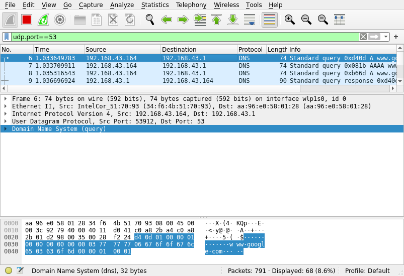
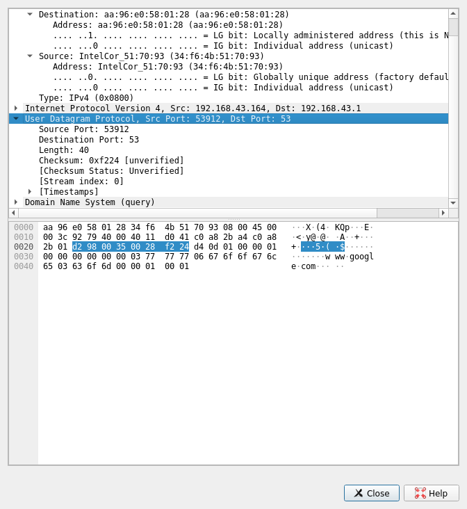

## Aim

Using Wireshark observe data transferred in client server communication using UDP
and identify the UDP datagram.

## Theory

Wireshark is a network packet analyzer. A network packet analyzer will try to
capture network packets and tries to display that packet data as detailed as possi-
ble. Some of the main uses include:

- Network administrators use it to troubleshoot network problems
- Developers use it to debug protocol implementations
- QA engineers use it to verify network applications
- Network security engineers use it to examine security problems
- People use it to learn network protocol internals

## Output

In the below image, the highlighted part in the hexdump represents the UDP datagram:

- Source port: `d2 98` $\rarrow$ `53912`
- Destination port: `00 35` $\rarrow$ `53`
- UDP Length: `00 28` $\rarrow$ `40`
- UDP Checksum: `f2 24`
